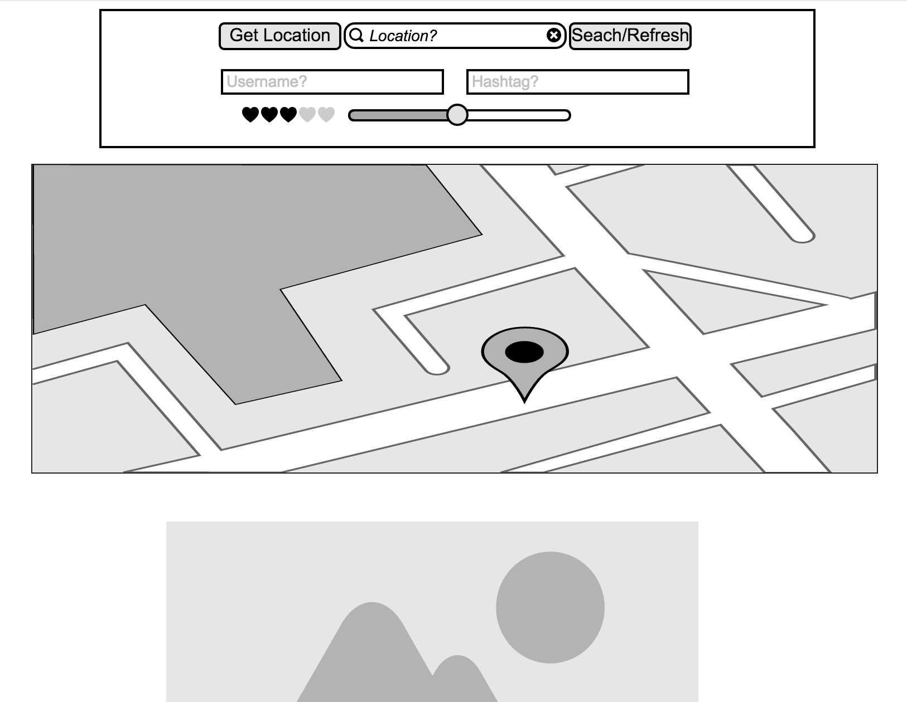

# Photolog

### About

Photolog is a SPA application using the Instagram API. It features a search query to allow the user to retrieve Instagram images based on either location or hashtag.

---
### Stack:

Application will be built on the MEAN stack -> Node + Angular with a backend connection to the Instagram API.

----
### View/Controller:

The application will be a SPA with 3-4 separate views

**Required:**

- Search box within map view...
    - by user | by hashtag | by # of likes
- Map view
    - User should be able to drop a pin on the map —> Map should populate with a image thumbnails based on user parameters
    - Default results will be based on popularity (# of likes)
- Image results
    - Results panel should fetch X number of images from the API

*Optional:*

- User authentication —> OAuth login using users Instagram account to render images from the users Instagram feed
